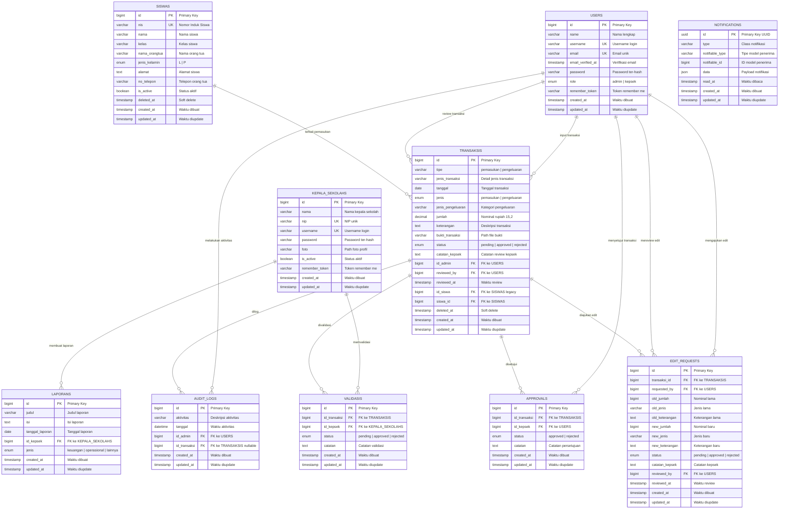
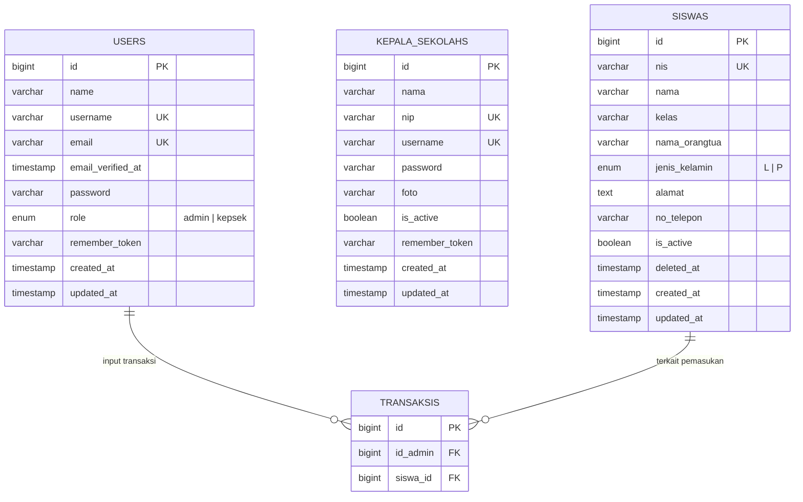
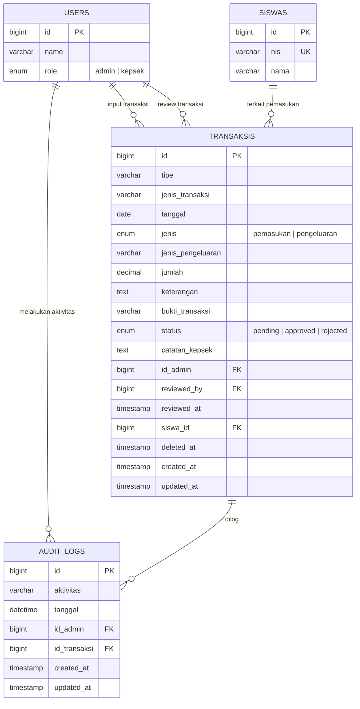
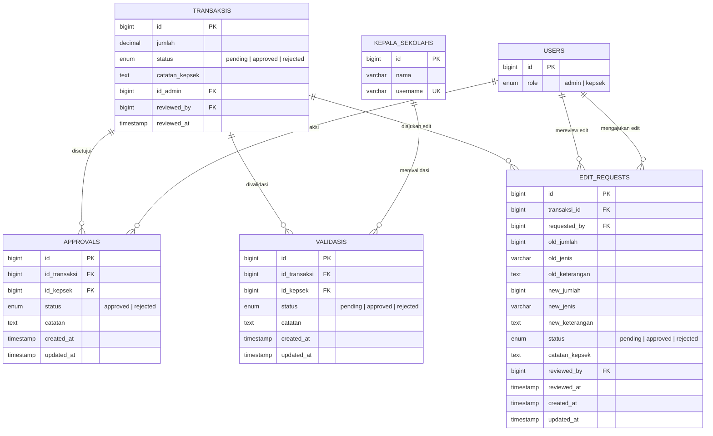
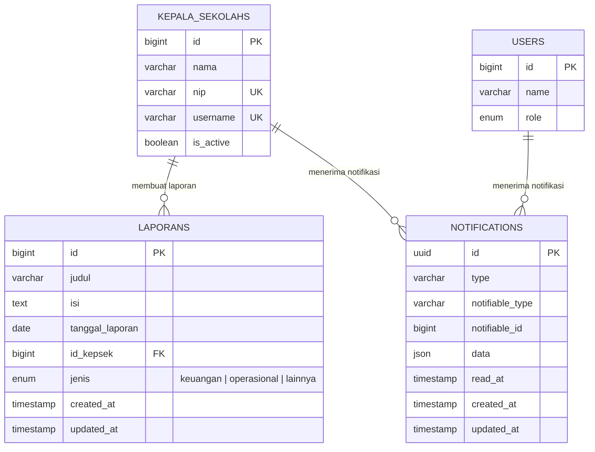

# BAB III
# PERANCANGAN SISTEM

## 3.3 Perancangan Database

Perancangan database pada Sistem Informasi Keuangan Sekolah (SIKEU) dilakukan untuk memastikan data keuangan sekolah tersimpan secara terstruktur, konsisten, dan aman. Database dirancang menggunakan model relasional dengan dukungan foreign key, soft delete, dan audit trail agar setiap transaksi pemasukan maupun pengeluaran dapat dilacak, divalidasi, dan diaudit.

Perancangan database SIKEU mengacu pada kebutuhan fungsional sistem, yaitu:

1. Autentikasi dan otorisasi pengguna (Admin/Bendahara dan Kepala Sekolah).
2. Pengelolaan data master siswa.
3. Pencatatan transaksi keuangan (pemasukan dan pengeluaran).
4. Mekanisme persetujuan dan validasi transaksi.
5. Permintaan edit transaksi dengan persetujuan kepala sekolah.
6. Pencatatan log audit aktivitas.
7. Pembuatan laporan oleh kepala sekolah.
8. Notifikasi in-app kepada pengguna.

Skema database diimplementasikan melalui Laravel Migration pada direktori `database/migrations/`. Berikut penjelasan struktur tabel beserta relasinya.

---

### 3.3.1 Entity Relationship Diagram (ERD)

Gambar 3.X menunjukkan hubungan antar entitas dalam database SIKEU beserta seluruh atribut pada masing-masing tabel. Entitas inti sistem adalah **TRANSAKSIS** yang berelasi dengan **USERS**, **SISWAS**, **AUDIT_LOGS**, **APPROVALS**, **VALIDASIS**, dan **EDIT_REQUESTS**. Entitas **KEPALA_SEKOLAHS** berfungsi sebagai autentikasi terpisah untuk validasi transaksi dan pembuatan laporan.

> **Cara render:** Salin kode Mermaid di bawah ke [mermaid.live](https://mermaid.live) atau plugin Mermaid di VS Code/Cursor, lalu export sebagai PNG/SVG untuk lampiran skripsi. File sumber terpisah: `docs/erd-sikeu.mmd`.



**Gambar 3.X Entity Relationship Diagram (ERD) Database SIKEU**

Diagram di atas menampilkan seluruh atribut domain bisnis. Legenda notasi:

| Notasi | Arti |
|--------|------|
| PK | Primary Key |
| FK | Foreign Key |
| UK | Unique Key |

---

### 3.3.1.1 Diagram ERD per Kelompok Entitas

Jika diagram lengkap terlalu padat saat dicetak, gunakan diagram terpisah berikut.

#### A. Autentikasi & Master Data



#### B. Transaksi & Audit



#### C. Persetujuan, Validasi & Edit Request



#### D. Laporan & Notifikasi



---

### 3.3.2 Penjelasan Tabel Database

#### 1. Tabel USERS

**a. Deskripsi**

Tabel master yang menyimpan data autentikasi untuk semua pengguna sistem SIKEU, yaitu Admin (Bendahara) dan Kepala Sekolah yang masuk melalui role `kepsek`. Tabel ini menjadi pusat identitas pengguna yang melakukan input transaksi, review transaksi, persetujuan, serta permintaan edit.

**b. Atribut**

| No | Nama Atribut | Tipe Data | Keterangan |
|----|--------------|-----------|------------|
| 1 | id | BIGINT (PK) | Primary Key, identitas unik pengguna |
| 2 | name | VARCHAR | Nama lengkap pengguna |
| 3 | username | VARCHAR (Unique) | Username untuk login |
| 4 | email | VARCHAR (Unique) | Alamat email pengguna |
| 5 | email_verified_at | TIMESTAMP | Waktu verifikasi email (nullable) |
| 6 | password | VARCHAR | Password ter-hash |
| 7 | role | ENUM | Peran pengguna: `admin` atau `kepsek` |
| 8 | remember_token | VARCHAR | Token remember me Laravel |
| 9 | created_at | TIMESTAMP | Waktu data dibuat |
| 10 | updated_at | TIMESTAMP | Waktu data diperbarui |

**c. Relasi**

- Berelasi **one-to-many** dengan tabel **TRANSAKSIS** (“**input transaksi**”): Satu akun admin/bendahara dapat mencatat banyak transaksi keuangan melalui atribut `id_admin`.
- Berelasi **one-to-many** dengan tabel **TRANSAKSIS** (“**mereview transaksi**”): Satu akun kepsek dapat mereview banyak transaksi melalui atribut `reviewed_by`.
- Berelasi **one-to-many** dengan tabel **AUDIT_LOGS** (“**melakukan aktivitas**”): Satu admin dapat menghasilkan banyak catatan log audit.
- Berelasi **one-to-many** dengan tabel **APPROVALS** (“**menyetujui transaksi**”): Satu user kepsek dapat menyetujui atau menolak banyak transaksi.
- Berelasi **one-to-many** dengan tabel **EDIT_REQUESTS** (“**mengajukan edit**”): Satu bendahara dapat mengajukan banyak permintaan perubahan transaksi melalui atribut `requested_by`.
- Berelasi **one-to-many** dengan tabel **EDIT_REQUESTS** (“**mereview edit**”): Satu kepsek dapat mereview banyak permintaan edit melalui atribut `reviewed_by`.

---

#### 2. Tabel KEPALA_SEKOLAHS

**a. Deskripsi**

Tabel master yang menyimpan informasi detail dan kredensial autentikasi kepala sekolah sebagai entitas terpisah dari tabel USERS. Tabel ini digunakan untuk proses validasi transaksi dan pembuatan laporan resmi sekolah.

**b. Atribut**

| No | Nama Atribut | Tipe Data | Keterangan |
|----|--------------|-----------|------------|
| 1 | id | BIGINT (PK) | Primary Key, identitas unik kepala sekolah |
| 2 | nama | VARCHAR | Nama lengkap kepala sekolah |
| 3 | nip | VARCHAR (Unique) | Nomor Induk Pegawai (nullable) |
| 4 | username | VARCHAR (Unique) | Username untuk login |
| 5 | password | VARCHAR | Password ter-hash |
| 6 | foto | VARCHAR | Path foto profil (nullable) |
| 7 | is_active | BOOLEAN | Status aktif akun (default: true) |
| 8 | remember_token | VARCHAR | Token remember me |
| 9 | created_at | TIMESTAMP | Waktu data dibuat |
| 10 | updated_at | TIMESTAMP | Waktu data diperbarui |

**c. Relasi**

- Berelasi **one-to-many** dengan tabel **VALIDASIS** (“**memvalidasi**”): Seorang kepala sekolah dapat memvalidasi banyak transaksi keuangan.
- Berelasi **one-to-many** dengan tabel **LAPORANS** (“**membuat laporan**”): Seorang kepala sekolah dapat membuat banyak laporan resmi.

---

#### 3. Tabel SISWAS

**a. Deskripsi**

Tabel master yang menyimpan informasi detail siswa sekolah, termasuk identitas, kelas, data orang tua, dan status keaktifan. Tabel ini menjadi referensi untuk transaksi pemasukan yang terkait siswa, seperti SPP dan iuran lainnya.

**b. Atribut**

| No | Nama Atribut | Tipe Data | Keterangan |
|----|--------------|-----------|------------|
| 1 | id | BIGINT (PK) | Primary Key, identitas unik siswa |
| 2 | nis | VARCHAR(20) (Unique) | Nomor Induk Siswa |
| 3 | nama | VARCHAR | Nama lengkap siswa |
| 4 | kelas | VARCHAR | Kelas siswa (nullable) |
| 5 | nama_orangtua | VARCHAR(100) | Nama orang tua/wali (nullable) |
| 6 | jenis_kelamin | ENUM | Jenis kelamin: `L` (Laki-laki) atau `P` (Perempuan) |
| 7 | alamat | TEXT | Alamat siswa (nullable) |
| 8 | no_telepon | VARCHAR(15) | Nomor telepon orang tua (nullable) |
| 9 | is_active | BOOLEAN | Status siswa aktif (default: true) |
| 10 | deleted_at | TIMESTAMP | Soft delete (nullable) |
| 11 | created_at | TIMESTAMP | Waktu data dibuat |
| 12 | updated_at | TIMESTAMP | Waktu data diperbarui |

**c. Relasi**

- Berelasi **one-to-many** dengan tabel **TRANSAKSIS** (“**terkait pemasukan**”): Satu siswa dapat terhubung dengan banyak transaksi pemasukan melalui atribut `siswa_id` dan `id_siswa`.

---

#### 4. Tabel TRANSAKSIS

**a. Deskripsi**

Tabel inti yang menyimpan seluruh data transaksi keuangan sekolah, baik pemasukan maupun pengeluaran. Tabel ini mencatat nominal, keterangan, bukti transaksi, status persetujuan, serta informasi reviewer. Setiap transaksi yang diinput admin harus melalui proses review sebelum status berubah menjadi approved atau rejected.

**b. Atribut**

| No | Nama Atribut | Tipe Data | Keterangan |
|----|--------------|-----------|------------|
| 1 | id | BIGINT (PK) | Primary Key, identitas unik transaksi |
| 2 | tipe | VARCHAR | Tipe transaksi: `pemasukan` atau `pengeluaran` |
| 3 | jenis_transaksi | VARCHAR | Detail jenis transaksi (default: Lain-lain) |
| 4 | tanggal | DATE | Tanggal transaksi |
| 5 | jenis | ENUM | Jenis transaksi: `pemasukan` atau `pengeluaran` |
| 6 | jenis_pengeluaran | VARCHAR | Kategori pengeluaran (nullable) |
| 7 | jumlah | DECIMAL(15,2) | Nominal transaksi dalam rupiah |
| 8 | keterangan | TEXT | Deskripsi transaksi (nullable) |
| 9 | bukti_transaksi | VARCHAR | Path file bukti transaksi (nullable) |
| 10 | status | ENUM | Status: `pending`, `approved`, atau `rejected` |
| 11 | catatan_kepsek | TEXT | Catatan kepala sekolah saat review (nullable) |
| 12 | id_admin | BIGINT (FK) | Foreign Key ke tabel USERS (bendahara input) |
| 13 | reviewed_by | BIGINT (FK) | Foreign Key ke tabel USERS (kepsek reviewer, nullable) |
| 14 | reviewed_at | TIMESTAMP | Waktu review (nullable) |
| 15 | id_siswa | BIGINT (FK) | Foreign Key ke tabel SISWAS (legacy, nullable) |
| 16 | siswa_id | BIGINT (FK) | Foreign Key ke tabel SISWAS (nullable) |
| 17 | deleted_at | TIMESTAMP | Soft delete (nullable) |
| 18 | created_at | TIMESTAMP | Waktu data dibuat |
| 19 | updated_at | TIMESTAMP | Waktu data diperbarui |

**c. Relasi**

- Berelasi **many-to-one** dengan tabel **USERS** (“**diinput oleh**”): Setiap transaksi dicatat oleh satu admin/bendahara.
- Berelasi **many-to-one** dengan tabel **USERS** (“**direview oleh**”): Setiap transaksi dapat direview oleh satu kepsek.
- Berelasi **many-to-one** dengan tabel **SISWAS** (“**milik siswa**”): Setiap transaksi pemasukan dapat terkait dengan satu siswa.
- Berelasi **one-to-many** dengan tabel **AUDIT_LOGS** (“**dilog**”): Satu transaksi dapat memiliki banyak catatan audit.
- Berelasi **one-to-many** dengan tabel **APPROVALS** (“**disetujui**”): Satu transaksi dapat memiliki banyak riwayat persetujuan.
- Berelasi **one-to-many** dengan tabel **VALIDASIS** (“**divalidasi**”): Satu transaksi dapat memiliki banyak riwayat validasi.
- Berelasi **one-to-many** dengan tabel **EDIT_REQUESTS** (“**diajukan edit**”): Satu transaksi dapat memiliki banyak permintaan perubahan data.

---

#### 5. Tabel AUDIT_LOGS

**a. Deskripsi**

Tabel yang menyimpan jejak audit setiap aktivitas yang dilakukan admin terhadap sistem. Log audit berfungsi sebagai bukti historis operasi seperti penambahan, pengubahan, atau penghapusan data transaksi.

**b. Atribut**

| No | Nama Atribut | Tipe Data | Keterangan |
|----|--------------|-----------|------------|
| 1 | id | BIGINT (PK) | Primary Key, identitas unik log |
| 2 | aktivitas | VARCHAR | Deskripsi aktivitas yang dilakukan |
| 3 | tanggal | DATETIME | Waktu aktivitas dilakukan |
| 4 | id_admin | BIGINT (FK) | Foreign Key ke tabel USERS |
| 5 | id_transaksi | BIGINT (FK) | Foreign Key ke tabel TRANSAKSIS (nullable) |
| 6 | created_at | TIMESTAMP | Waktu data dibuat |
| 7 | updated_at | TIMESTAMP | Waktu data diperbarui |

**c. Relasi**

- Berelasi **many-to-one** dengan tabel **USERS** (“**dilakukan oleh**”): Setiap log audit dicatat oleh satu admin.
- Berelasi **many-to-one** dengan tabel **TRANSAKSIS** (“**terkait transaksi**”): Setiap log audit dapat terhubung ke satu transaksi; atribut ini nullable agar log tetap tersimpan meskipun transaksi sudah dihapus.

---

#### 6. Tabel APPROVALS

**a. Deskripsi**

Tabel yang menyimpan riwayat persetujuan atau penolakan transaksi oleh kepala sekolah melalui akun pada tabel USERS dengan role `kepsek`. Setiap baris approval merepresentasikan keputusan final terhadap satu transaksi.

**b. Atribut**

| No | Nama Atribut | Tipe Data | Keterangan |
|----|--------------|-----------|------------|
| 1 | id | BIGINT (PK) | Primary Key, identitas unik approval |
| 2 | id_transaksi | BIGINT (FK) | Foreign Key ke tabel TRANSAKSIS |
| 3 | id_kepsek | BIGINT (FK) | Foreign Key ke tabel USERS (role kepsek) |
| 4 | status | ENUM | Status keputusan: `approved` atau `rejected` |
| 5 | catatan | TEXT | Catatan persetujuan/penolakan (nullable) |
| 6 | created_at | TIMESTAMP | Waktu data dibuat |
| 7 | updated_at | TIMESTAMP | Waktu data diperbarui |

**c. Relasi**

- Berelasi **many-to-one** dengan tabel **TRANSAKSIS** (“**menyetujui transaksi**”): Setiap approval merujuk ke satu transaksi.
- Berelasi **many-to-one** dengan tabel **USERS** (“**disetujui oleh**”): Setiap approval dicatat oleh satu user kepsek.

---

#### 7. Tabel VALIDASIS

**a. Deskripsi**

Tabel yang menyimpan riwayat validasi transaksi oleh kepala sekolah melalui autentikasi pada tabel KEPALA_SEKOLAHS. Validasi berfungsi sebagai mekanisme kontrol terhadap transaksi keuangan sebelum dianggap sah.

**b. Atribut**

| No | Nama Atribut | Tipe Data | Keterangan |
|----|--------------|-----------|------------|
| 1 | id | BIGINT (PK) | Primary Key, identitas unik validasi |
| 2 | id_transaksi | BIGINT (FK) | Foreign Key ke tabel TRANSAKSIS |
| 3 | id_kepsek | BIGINT (FK) | Foreign Key ke tabel KEPALA_SEKOLAHS |
| 4 | status | ENUM | Status: `pending`, `approved`, atau `rejected` |
| 5 | catatan | TEXT | Catatan validasi (nullable) |
| 6 | created_at | TIMESTAMP | Waktu data dibuat |
| 7 | updated_at | TIMESTAMP | Waktu data diperbarui |

**c. Relasi**

- Berelasi **many-to-one** dengan tabel **TRANSAKSIS** (“**divalidasi**”): Setiap validasi merujuk ke satu transaksi.
- Berelasi **many-to-one** dengan tabel **KEPALA_SEKOLAHS** (“**dilakukan oleh**”): Setiap validasi dicatat oleh satu kepala sekolah.

---

#### 8. Tabel EDIT_REQUESTS

**a. Deskripsi**

Tabel yang menyimpan permintaan perubahan data transaksi dari bendahara. Perubahan tidak langsung diterapkan; bendahara harus mengajukan edit request yang kemudian direview dan disetujui atau ditolak oleh kepala sekolah.

**b. Atribut**

| No | Nama Atribut | Tipe Data | Keterangan |
|----|--------------|-----------|------------|
| 1 | id | BIGINT (PK) | Primary Key, identitas unik permintaan edit |
| 2 | transaksi_id | BIGINT (FK) | Foreign Key ke tabel TRANSAKSIS |
| 3 | requested_by | BIGINT (FK) | Foreign Key ke tabel USERS (bendahara pemohon) |
| 4 | old_jumlah | BIGINT | Nominal sebelum perubahan |
| 5 | old_jenis | VARCHAR | Jenis sebelum perubahan |
| 6 | old_keterangan | TEXT | Keterangan sebelum perubahan (nullable) |
| 7 | new_jumlah | BIGINT | Nominal usulan perubahan |
| 8 | new_jenis | VARCHAR | Jenis usulan perubahan |
| 9 | new_keterangan | TEXT | Keterangan usulan perubahan (nullable) |
| 10 | status | ENUM | Status: `pending`, `approved`, atau `rejected` |
| 11 | catatan_kepsek | TEXT | Catatan kepsek (nullable) |
| 12 | reviewed_by | BIGINT (FK) | Foreign Key ke tabel USERS (nullable) |
| 13 | reviewed_at | TIMESTAMP | Waktu review (nullable) |
| 14 | created_at | TIMESTAMP | Waktu data dibuat |
| 15 | updated_at | TIMESTAMP | Waktu data diperbarui |

**c. Relasi**

- Berelasi **many-to-one** dengan tabel **TRANSAKSIS** (“**mengubah transaksi**”): Setiap permintaan edit merujuk ke satu transaksi.
- Berelasi **many-to-one** dengan tabel **USERS** (“**diajukan oleh**”): Setiap permintaan diajukan oleh satu bendahara.
- Berelasi **many-to-one** dengan tabel **USERS** (“**direview oleh**”): Setiap permintaan dapat direview oleh satu kepsek.

---

#### 9. Tabel LAPORANS

**a. Deskripsi**

Tabel yang menyimpan laporan resmi yang dibuat kepala sekolah terkait keuangan, operasional, atau hal lainnya. Laporan menjadi dokumen pendukung pengawasan dan pertanggungjawaban keuangan sekolah.

**b. Atribut**

| No | Nama Atribut | Tipe Data | Keterangan |
|----|--------------|-----------|------------|
| 1 | id | BIGINT (PK) | Primary Key, identitas unik laporan |
| 2 | judul | VARCHAR | Judul laporan |
| 3 | isi | TEXT | Isi laporan (nullable) |
| 4 | tanggal_laporan | DATE | Tanggal laporan dibuat |
| 5 | id_kepsek | BIGINT (FK) | Foreign Key ke tabel KEPALA_SEKOLAHS |
| 6 | jenis | ENUM | Jenis laporan: `keuangan`, `operasional`, atau `lainnya` |
| 7 | created_at | TIMESTAMP | Waktu data dibuat |
| 8 | updated_at | TIMESTAMP | Waktu data diperbarui |

**c. Relasi**

- Berelasi **many-to-one** dengan tabel **KEPALA_SEKOLAHS** (“**dibuat oleh**”): Setiap laporan dibuat oleh satu kepala sekolah.

---

#### 10. Tabel NOTIFICATIONS

**a. Deskripsi**

Tabel yang menyimpan notifikasi in-app untuk pengguna sistem, seperti pemberitahuan transaksi pengeluaran yang menunggu persetujuan atau permintaan edit baru. Tabel ini menggunakan relasi polimorfik sehingga notifikasi dapat diterima baik oleh USERS maupun KEPALA_SEKOLAHS.

**b. Atribut**

| No | Nama Atribut | Tipe Data | Keterangan |
|----|--------------|-----------|------------|
| 1 | id | UUID (PK) | Primary Key, identitas unik notifikasi |
| 2 | type | VARCHAR | Class tipe notifikasi Laravel |
| 3 | notifiable_type | VARCHAR | Tipe model penerima (polimorfik) |
| 4 | notifiable_id | BIGINT | ID model penerima (polimorfik) |
| 5 | data | JSON | Payload isi notifikasi |
| 6 | read_at | TIMESTAMP | Waktu notifikasi dibaca (nullable) |
| 7 | created_at | TIMESTAMP | Waktu data dibuat |
| 8 | updated_at | TIMESTAMP | Waktu data diperbarui |

**c. Relasi**

- Berelasi **polimorfik many-to-one** dengan tabel **USERS** atau **KEPALA_SEKOLAHS** (“**diterima oleh**”): Satu entitas pengguna dapat menerima banyak notifikasi.

---

### 3.3.3 Tabel Pendukung Infrastruktur

Selain tabel domain bisnis, sistem SIKEU juga menggunakan tabel pendukung bawaan Laravel:

| No | Nama Tabel | Fungsi |
|----|------------|--------|
| 1 | sessions | Menyimpan session login pengguna web |
| 2 | password_reset_tokens | Menyimpan token reset password |
| 3 | cache, cache_locks | Menyimpan data cache aplikasi |
| 4 | jobs, job_batches, failed_jobs | Mengelola antrian background job |

Tabel-tabel ini tidak termasuk dalam ERD domain bisnis karena bersifat teknis/infrastruktur aplikasi.

---

### 3.3.4 Aturan Integritas dan Constraint

Berikut aturan integritas data yang diterapkan pada database SIKEU:

**1. Primary Key**

Setiap tabel memiliki primary key pada atribut `id` (kecuali `notifications` yang menggunakan UUID, serta tabel infrastruktur Laravel).

**2. Foreign Key dan Cascade**

| Relasi | Aturan On Delete |
|--------|------------------|
| transaksis.id_admin → users.id | CASCADE |
| transaksis.reviewed_by → users.id | SET NULL |
| transaksis.siswa_id → siswas.id | SET NULL |
| audit_logs.id_transaksi → transaksis.id | CASCADE |
| approvals.id_transaksi → transaksis.id | CASCADE |
| validasis.id_transaksi → transaksis.id | CASCADE |
| edit_requests.transaksi_id → transaksis.id | CASCADE |

**3. Unique Constraint**

- `users.email`, `users.username`
- `kepala_sekolahs.nip`, `kepala_sekolahs.username`
- `siswas.nis`

**4. Soft Delete**

Tabel **SISWAS** dan **TRANSAKSIS** menggunakan soft delete (`deleted_at`) sehingga data tidak dihapus permanen dari database.

**5. Status Workflow**

Transaksi dan edit request mengikuti alur status:

```
pending → approved
pending → rejected
```

---

### 3.3.5 Ringkasan Relasi Antar Tabel

Tabel 3.X Ringkasan Relasi Database SIKEU

| No | Tabel Induk | Tabel Anak | Kardinalitas | Label Relasi | Foreign Key |
|----|-------------|------------|--------------|--------------|-------------|
| 1 | USERS | TRANSAKSIS | 1 : N | input transaksi | id_admin |
| 2 | USERS | TRANSAKSIS | 1 : N | review transaksi | reviewed_by |
| 3 | USERS | AUDIT_LOGS | 1 : N | melakukan aktivitas | id_admin |
| 4 | USERS | APPROVALS | 1 : N | menyetujui transaksi | id_kepsek |
| 5 | USERS | EDIT_REQUESTS | 1 : N | mengajukan edit | requested_by |
| 6 | USERS | EDIT_REQUESTS | 1 : N | mereview edit | reviewed_by |
| 7 | KEPALA_SEKOLAHS | VALIDASIS | 1 : N | memvalidasi | id_kepsek |
| 8 | KEPALA_SEKOLAHS | LAPORANS | 1 : N | membuat laporan | id_kepsek |
| 9 | SISWAS | TRANSAKSIS | 1 : N | terkait pemasukan | siswa_id |
| 10 | TRANSAKSIS | AUDIT_LOGS | 1 : N | dilog | id_transaksi |
| 11 | TRANSAKSIS | APPROVALS | 1 : N | disetujui | id_transaksi |
| 12 | TRANSAKSIS | VALIDASIS | 1 : N | divalidasi | id_transaksi |
| 13 | TRANSAKSIS | EDIT_REQUESTS | 1 : N | diajukan edit | transaksi_id |

---

### 3.3.6 Alur Data Transaksi Keuangan

Alur data pada tabel **TRANSAKSIS** dapat dijelaskan sebagai berikut:

1. Admin (bendahara) login melalui tabel **USERS** dan menginput transaksi baru dengan status `pending`.
2. Transaksi yang terkait siswa akan mereferensikan data pada tabel **SISWAS**.
3. Setiap aksi admin dicatat pada tabel **AUDIT_LOGS**.
4. Kepala sekolah mereview transaksi; keputusan disimpan pada **APPROVALS**, **VALIDASIS**, dan kolom review di **TRANSAKSIS**.
5. Jika bendahara ingin mengubah transaksi, permintaan dicatat pada **EDIT_REQUESTS** dan menunggu persetujuan kepsek.
6. Kepala sekolah dapat membuat **LAPORANS** berdasarkan data keuangan yang telah tervalidasi.
7. Notifikasi terkait proses di atas dikirim melalui tabel **NOTIFICATIONS**.

---

**Catatan untuk penyusunan Word:**

- Ganti "3.X" pada nomor gambar dan tabel sesuai struktur bab skripsi Anda.
- Salin isi file ini ke Microsoft Word, lalu terapkan gaya heading sesuai template kampus.
- Diagram Mermaid dapat dirender di [mermaid.live](https://mermaid.live) lalu disisipkan sebagai **Gambar 3.X ERD Database SIKEU**.
- Sesuaikan judul bab induk (BAB III) jika perancangan database berada di sub-bab berbeda pada template fakultas Anda.
